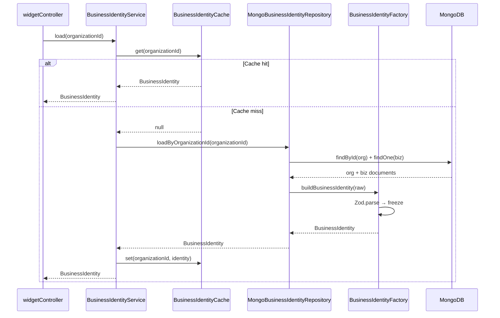
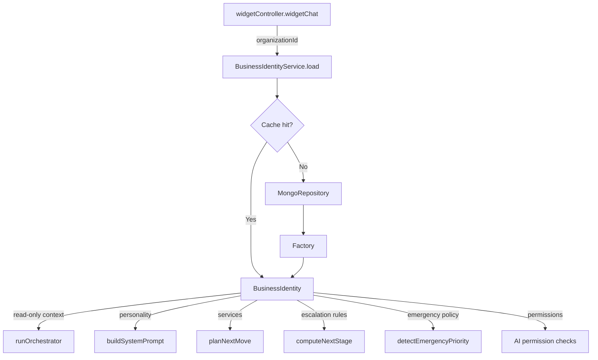

# Business Identity Engine — Architecture

## Overview

The Business Identity Engine is **Layer 1** of the LeadFlow AI platform.
It defines everything about a business *before* any conversation begins and
provides an immutable, validated context object to every downstream component.

Every AI conversation turn starts by calling:

```ts
const identity = await BusinessIdentityService.load(organizationId);
```

From that point the orchestrator, planner, prompt-builder, and guardrails all
read from this single object. Nothing mutates it.

---

## Module Responsibilities

| Module | File | Responsibility |
|---|---|---|
| **Types** | `types.ts` | All interfaces and enums — no logic |
| **Schemas** | `schemas.ts` | Zod validation for every field |
| **Factory** | `BusinessIdentityFactory.ts` | Validates + constructs immutable aggregate |
| **Service** | `BusinessIdentityService.ts` | Cache → repo → factory orchestration |
| **Repository** | `repository/` | Storage abstraction (`IBusinessIdentityRepository`) |
| **Cache** | `cache/BusinessIdentityCache.ts` | In-process TTL + LRU cache |
| **ServiceArea** | `modules/service-area.module.ts` | `servesLocation()`, `isOutsideServiceArea()`, `getTravelFee()` |
| **ServicesCatalog** | `modules/services-catalog.module.ts` | `listBookableServices()`, `matchServiceFromIntent()`, `getServiceByName()` |
| **BusinessHours** | `modules/business-hours.module.ts` | `isOpen()`, `nextOpeningTime()` |
| **EmergencyPolicy** | `modules/emergency-policy.module.ts` | `detectEmergencyPriority()`, `isEmergency()` |
| **EscalationPolicy** | `modules/escalation-policy.module.ts` | `shouldEscalateOnMessage()`, `shouldEscalateOnScore()` |
| **Permissions** | `modules/permissions.module.ts` | `isPermitted()`, `isDenied()`, `getDenialReason()` |
| **BrandPersonality** | `modules/brand-personality.module.ts` | `toPromptDirectives()` → Gemini-ready string |
| **ConversationRules** | `modules/conversation-rules.module.ts` | `toPromptDirectives()`, `isRuleEnabled()` |
| **ReceptionistIdentity** | `modules/receptionist-identity.module.ts` | `renderGreeting()`, `renderIntroduction()`, `renderSignOff()` |

---

## Loading Sequence



---

## Data Flow — Conversation Turn



---

## Dependency Flow

```
BusinessIdentityService
    └── IBusinessIdentityRepository (interface)
            └── MongoBusinessIdentityRepository (MongoDB implementation)
                    └── BusinessIdentityFactory
                            └── schemas.ts (Zod)
                            └── types.ts

    └── BusinessIdentityCache (in-process TTL/LRU)

Modules (pure functions, no deps):
    service-area.module.ts
    services-catalog.module.ts
    business-hours.module.ts
    emergency-policy.module.ts
    escalation-policy.module.ts
    permissions.module.ts
    brand-personality.module.ts
    conversation-rules.module.ts
    receptionist-identity.module.ts
```

Modules have **zero dependencies** on each other or on any framework code.
They accept typed values and return typed values — trivially testable.

---

## Immutability

`buildBusinessIdentity()` calls `Object.freeze()` recursively on every object
and array in the aggregate. Attempting to mutate any field throws `TypeError`
in strict mode.

This ensures:
- No component can accidentally corrupt shared state across concurrent requests
- The identity loaded at the start of a conversation is identical at the end
- Caching is safe — the cached reference cannot be modified by any consumer

---

## Multi-Tenancy

Every load is scoped to `organizationId`. The MongoDB repository filters both
`Organization` and `Business` documents by `organizationId`. The cache key is
`organizationId`. No cross-tenant data can leak through this layer.

---

## Extending for a New Industry

1. Add the industry key to the `Industry` enum in `types.ts` and `schemas.ts`
2. Add identifier keywords to `MongoBusinessIdentityRepository.normalizeIndustry()`
3. Optionally add an industry-specific `IndustryProfile` in `ai/industry-profiles.ts`

No other files change. The planner and orchestrator pick up the new industry automatically.

---

## Cache Invalidation

Call `BusinessIdentityService.invalidate(organizationId)` or `refresh(organizationId)`
whenever business settings are updated (e.g. in the Business Settings controller's
`update` handler). This ensures the next conversation turn loads fresh config.

For multi-instance deployments, replace `BusinessIdentityCache` with a Redis
implementation of `IBusinessIdentityCache` — the service layer is unchanged.

---

## Backward Compatibility

The engine is **additive** — it does not modify any existing file.
The orchestrator continues to call `loadOrgContext()` (the existing function in
`orchestrator.ts`) unchanged. Adopting `BusinessIdentityService` is opt-in:
replace `loadOrgContext()` with `BusinessIdentityService.load()` when ready.

---

## File Structure

```
src/business-identity/
├── ARCHITECTURE.md                    ← this file
├── index.ts                           ← public API barrel
├── types.ts                           ← all interfaces + enums
├── schemas.ts                         ← Zod validation schemas
├── BusinessIdentityFactory.ts         ← validate + freeze aggregate
├── BusinessIdentityService.ts         ← cache → repo → factory
├── modules/
│   ├── service-area.module.ts
│   ├── services-catalog.module.ts
│   ├── business-hours.module.ts
│   ├── emergency-policy.module.ts
│   ├── escalation-policy.module.ts
│   ├── permissions.module.ts
│   ├── brand-personality.module.ts
│   ├── conversation-rules.module.ts
│   └── receptionist-identity.module.ts
├── repository/
│   ├── BusinessIdentityRepository.ts  ← IBusinessIdentityRepository interface
│   └── MongoBusinessIdentityRepository.ts ← MongoDB implementation
├── cache/
│   └── BusinessIdentityCache.ts       ← TTL + LRU in-process cache
└── __tests__/
    └── business-identity.test.ts      ← 52 unit tests
```
