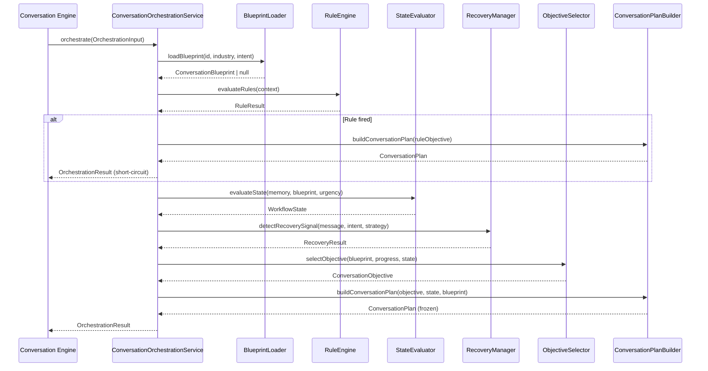
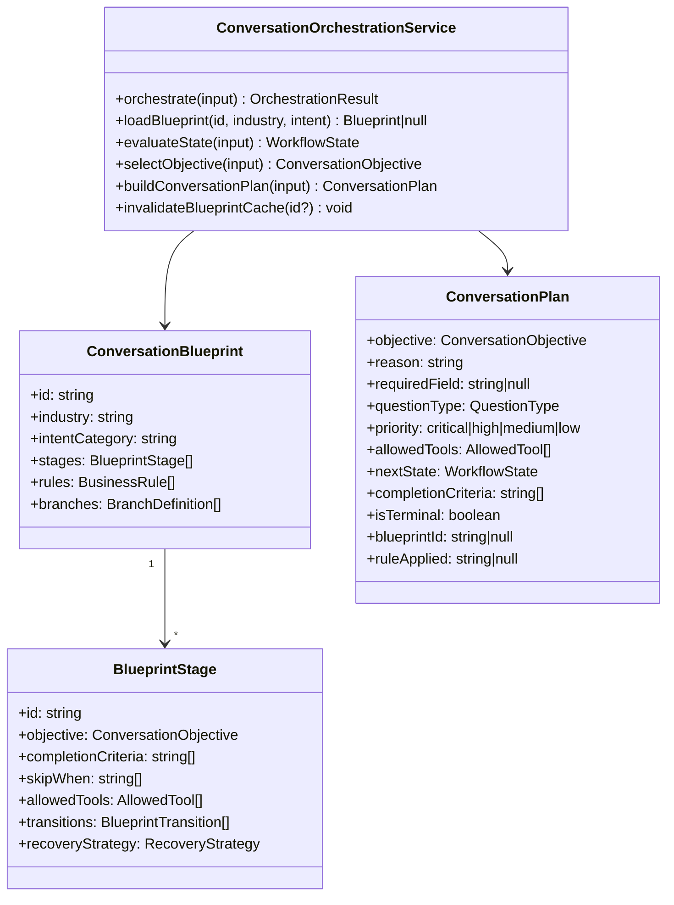
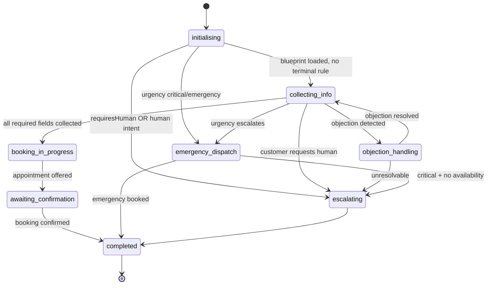
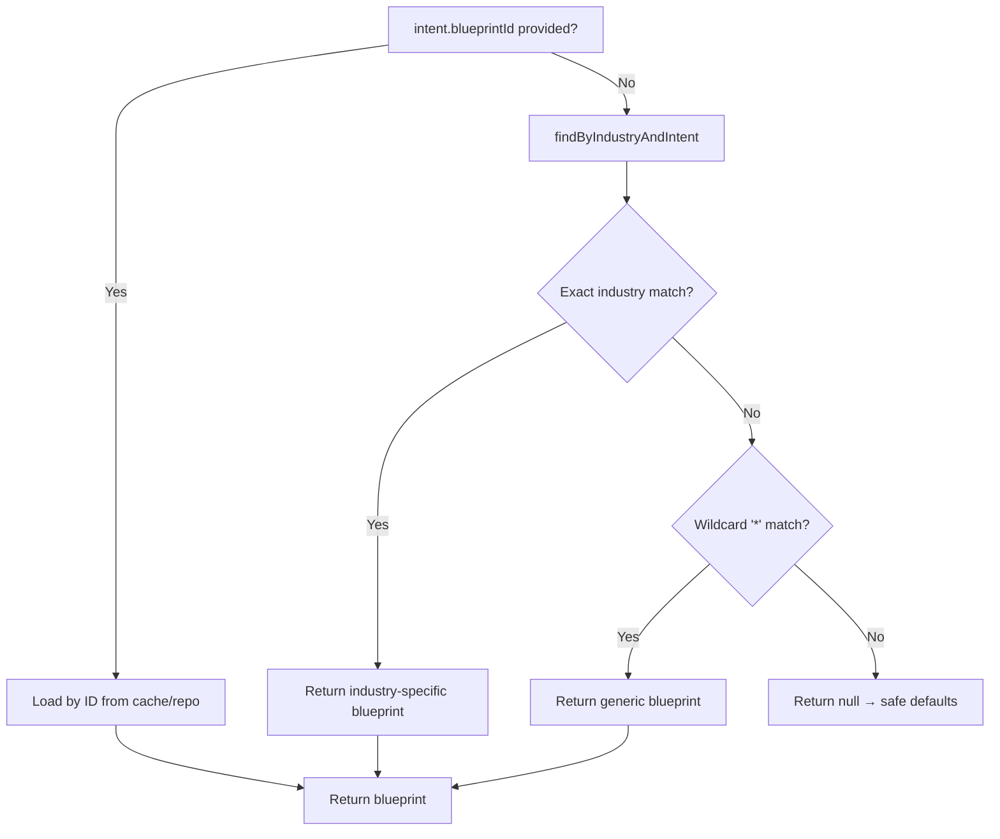

# Conversation Orchestration Engine — Architecture (Layer 3)

## Overview

Layer 3 is the **workflow brain** of LeadFlow OS.

Every conversation turn it answers one question:
**What is the next business objective?**

It never generates language. It never calls an LLM. It never mutates memory.
Its only output is a deterministic, immutable `ConversationPlan` that Layer 6
(Response Engine) will later express in natural language.

This design means the same orchestration engine can drive chat, voice, SMS,
WhatsApp, or email without changing a single line of core logic.

---

## Orchestration Pipeline



---

## Module Responsibilities

| Module | File | Single Responsibility |
|---|---|---|
| **ConversationOrchestrationService** | `ConversationOrchestrationService.ts` | Coordinates all modules — single entry point |
| **BlueprintLoader** | `modules/blueprint-loader.ts` | Resolves blueprint: cache → repo → null |
| **RuleEngine** | `modules/rule-engine.ts` | Evaluates business rules; highest-priority override wins |
| **StateEvaluator** | `modules/state-evaluator.ts` | Derives WorkflowState from inputs — never mutates |
| **RecoveryManager** | `modules/recovery-manager.ts` | Detects topic change, correction, dont_know, already_answered |
| **ObjectiveSelector** | `modules/objective-selector.ts` | Walks blueprint stages in order; returns first incomplete objective |
| **CompletionEvaluator** | `modules/completion-evaluator.ts` | Determines if an objective is complete from memory/progress |
| **ConversationPlanBuilder** | `modules/conversation-plan-builder.ts` | Assembles frozen ConversationPlan |
| **InMemoryBlueprintRepository** | `repository/InMemoryBlueprintRepository.ts` | Default static blueprints, Zod-validated |
| **BlueprintCache** | `cache/BlueprintCache.ts` | TTL + LRU in-process cache |

---

## Domain Model



---

## State Diagram



---

## Blueprint Selection Flow



---

## Rule Priority System

Rules are evaluated in descending priority order. The first rule that fires
short-circuits all remaining logic and returns immediately.

| Priority | Rule | Trigger | Action |
|---|---|---|---|
| 100 | Emergency critical | `urgency === critical` | Skip to emergency booking |
| 95 | Human representative | `requiresHuman or intent=human_representative` | Escalate immediately |
| 90 | Emergency urgency | `urgency === emergency` | Skip to emergency booking |
| 85 | Complaint | `intent === complaint` | Escalate immediately |
| 80 | Business closed | `!isOpen(businessHours)` | Offer next available slot |
| 70 | Billing | `intent === billing_question` | Set billing objective |

Rules are defined in blueprint configuration — never hardcoded in engine logic.

---

## Recovery Scenarios

| Signal | Detection | Action |
|---|---|---|
| `already_answered` | "I already told you / I already said" | Stay on current objective |
| `dont_know` | "I don't know / not sure" | Switch to `clarify_intent` |
| `correction` | "Actually / wait / no, I meant" | Stay on objective to re-collect |
| `topic_change` | High-priority intent shift (billing, complaint, human) | Switch to mapped objective |
| `none` | Normal reply | Continue with selected objective |

Recovery preserves context whenever possible. The conversation never restarts
unless a business rule explicitly demands it.

---

## Extending for a New Industry

1. Add blueprint data to `blueprints/default-blueprints.ts` (or store in DB)
2. No engine code changes needed

## Extending with a New Business Rule

1. Add the `RuleTrigger` to `types.ts` and `schemas.ts`
2. Add the trigger test to `modules/rule-engine.ts` `testTrigger()`
3. Add the rule to the blueprint configuration

## Extending with a New Objective

1. Add to `ConversationObjective` union in `types.ts` and `schemas.ts`
2. Add to `OBJECTIVE_FIELDS` / `OBJECTIVE_QUESTION_TYPE` in `conversation-plan-builder.ts`
3. Add to `isObjectiveComplete()` in `completion-evaluator.ts`

---

## File Structure

```
src/conversation-engine/
├── ARCHITECTURE.md
├── index.ts                          ← public API barrel
├── types.ts                          ← all domain types and enums
├── schemas.ts                        ← Zod validation schemas
├── ConversationOrchestrationService.ts ← single entry point
├── blueprints/
│   └── default-blueprints.ts         ← HVAC, plumbing, generic blueprints
├── modules/
│   ├── blueprint-loader.ts
│   ├── rule-engine.ts
│   ├── state-evaluator.ts
│   ├── objective-selector.ts
│   ├── completion-evaluator.ts
│   ├── recovery-manager.ts
│   └── conversation-plan-builder.ts
├── repository/
│   ├── BlueprintRepository.ts        ← IBlueprintRepository interface
│   └── InMemoryBlueprintRepository.ts
├── cache/
│   └── BlueprintCache.ts             ← TTL + LRU cache
└── __tests__/
    └── conversation-engine.test.ts   ← 46 unit tests
```
