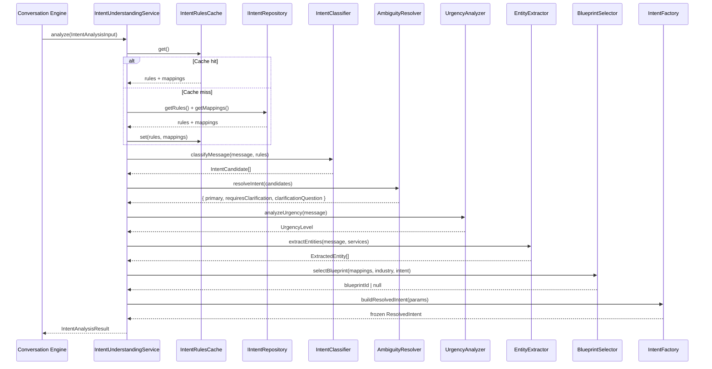
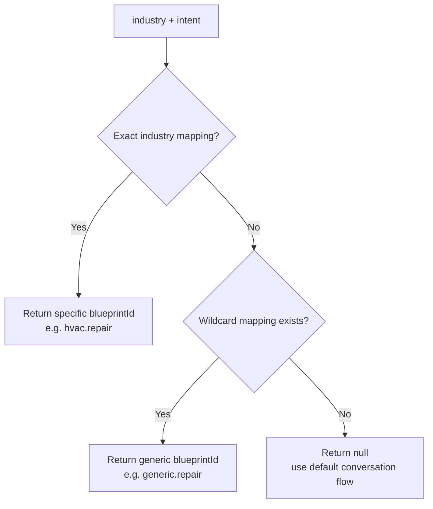

# Intent Understanding Engine — Architecture (Layer 2)

## Overview

The Intent Understanding Engine answers one question before any conversation begins:
**Why did this customer reach out?**

It is deterministic, LLM-independent, and fully testable. Gemini may assist with
language generation *after* intent is resolved, but it never decides intent.
The engine owns the final decision.

---

## Intent Understanding Lifecycle



---

## Module Responsibilities

| Module | File | Responsibility |
|---|---|---|
| **Types** | `types.ts` | All interfaces, enums — no logic |
| **Schemas** | `schemas.ts` | Zod validation for registry data |
| **IntentClassifier** | `modules/intent-classifier.ts` | Score every rule against input text → ranked candidates |
| **AmbiguityResolver** | `modules/ambiguity-resolver.ts` | Select primary from candidates; detect ambiguity; write clarification question |
| **ConfidenceEvaluator** | `modules/confidence-evaluator.ts` | Map raw scores → typed ConfidenceLevel; `isCertain()`, `requiresClarification()` |
| **UrgencyAnalyzer** | `modules/urgency-analyzer.ts` | Analyze urgency independently from intent |
| **EntityExtractor** | `modules/entity-extractor.ts` | Extract equipment, time, phone, ZIP, name, city |
| **BlueprintSelector** | `modules/blueprint-selector.ts` | Config-driven (industry, intent) → blueprintId |
| **IntentFactory** | `IntentFactory.ts` | Constructs frozen ResolvedIntent — only place it is created |
| **IntentUnderstandingService** | `IntentUnderstandingService.ts` | Public entry point — orchestrates all modules |
| **InMemoryIntentRepository** | `repository/InMemoryIntentRepository.ts` | Default rules + mappings from static registry |
| **IntentRulesCache** | `cache/IntentRulesCache.ts` | TTL cache for rules and mappings |
| **DefaultRules** | `registry/default-rules.ts` | All keyword rules and blueprint mappings |

---

## Class / Module Diagram

```mermaid
classDiagram
    class IntentUnderstandingService {
        +analyze(input) IntentAnalysisResult
        +classify(message) IntentCandidate[]
        +resolve(candidates) ResolutionResult
        +selectBlueprint(industry, intent) string|null
        +invalidateCache() void
    }

    class IntentClassifier {
        +classifyMessage(message, rules) IntentCandidate[]
    }

    class AmbiguityResolver {
        +resolveIntent(candidates) ResolutionResult
    }

    class ConfidenceEvaluator {
        +toConfidenceLevel(score) ConfidenceLevel
        +isCertain(level) boolean
        +requiresClarification(candidates) boolean
        +shouldEscalate(category, level) boolean
    }

    class UrgencyAnalyzer {
        +analyzeUrgency(message) UrgencyLevel
        +urgencySignals(message) string[]
    }

    class EntityExtractor {
        +extractEntities(message, services) ExtractedEntity[]
    }

    class BlueprintSelector {
        +selectBlueprint(mappings, industry, intent) string|null
    }

    class IntentFactory {
        +buildResolvedIntent(params) ResolvedIntent
    }

    class IIntentRepository {
        <<interface>>
        +getRules() IntentKeywordRule[]
        +getMappings() BlueprintMapping[]
        +findByCategory(cat) IntentKeywordRule|undefined
    }

    class IntentRulesCache {
        +get() rules+mappings|null
        +set(rules, mappings) void
        +invalidate() void
    }

    IntentUnderstandingService --> IntentClassifier
    IntentUnderstandingService --> AmbiguityResolver
    IntentUnderstandingService --> ConfidenceEvaluator
    IntentUnderstandingService --> UrgencyAnalyzer
    IntentUnderstandingService --> EntityExtractor
    IntentUnderstandingService --> BlueprintSelector
    IntentUnderstandingService --> IntentFactory
    IntentUnderstandingService --> IIntentRepository
    IntentUnderstandingService --> IntentRulesCache
```



---

## Dependency Graph

```
IntentUnderstandingService
    ├── modules/intent-classifier        (pure, no deps)
    ├── modules/ambiguity-resolver       (pure, no deps)
    ├── modules/confidence-evaluator     (pure, no deps)
    ├── modules/urgency-analyzer         (pure, no deps)
    ├── modules/entity-extractor         (pure, no deps)
    ├── modules/blueprint-selector       (pure, no deps)
    ├── IntentFactory                    (crypto.randomUUID only)
    ├── IIntentRepository  (interface)
    │       └── InMemoryIntentRepository (default rules registry)
    └── IntentRulesCache                 (in-process TTL)

Layer 1 consumed via:
    IntentAnalysisInput.availableServices  ← from BusinessIdentity.servicesCatalog
    IntentAnalysisInput.industry           ← from BusinessIdentity.companyProfile.industry
```

All module functions are pure — no network calls, no DB, no side effects.
Only `IntentUnderstandingService` has async I/O (cache + repo).

---

## Blueprint Selection Flow



Mappings are sorted by:
1. Exact industry match over wildcard `*`
2. Explicit `priority` value (higher wins)

---

## Confidence Evaluation Strategy

```
Raw score 0–100
    │
    ├─ ≥ 90  → very_high  (isCertain = true)
    ├─ ≥ 70  → high       (isCertain = true)
    ├─ ≥ 50  → medium     (requiresClarification possible)
    ├─ ≥ 30  → low        (requiresClarification likely)
    └─  < 30  → unknown   (engine returns unknown intent, conversation continues)

Raw scores are NEVER exposed outside the engine.
Consumers always work with ConfidenceLevel (typed enum).
```

Clarification is triggered when:
- Primary confidence is below `high` AND
- Top two candidates are within 15 points of each other

Exceptions — these intents NEVER trigger clarification:
- `human_representative` — always escalate immediately
- `emergency_service` — always treat as emergency immediately

---

## Extension Guide — Adding a New Intent

1. **Add to the enum** in `types.ts`:
   ```ts
   export type IntentCategory = ... | 'my_new_intent';
   ```

2. **Add to the Zod schema** in `schemas.ts`:
   ```ts
   export const IntentCategorySchema = z.enum([..., 'my_new_intent']);
   ```

3. **Add a keyword rule** in `registry/default-rules.ts`:
   ```ts
   {
     intent: 'my_new_intent',
     subCategory: '',
     keywords: ['keyword1', 'keyword2'],
     phrases:  ['exact phrase match'],
     weight: 1,
   }
   ```

4. **Add blueprint mappings** in `registry/default-rules.ts`:
   ```ts
   { industry: 'hvac', intent: 'my_new_intent', blueprintId: 'hvac.my_blueprint', priority: 10 },
   { industry: '*',    intent: 'my_new_intent', blueprintId: 'generic.my_blueprint', priority: 0 },
   ```

5. **Add a clarification template** in `modules/ambiguity-resolver.ts` (optional):
   ```ts
   my_new_intent: "Are you looking for X or Y?",
   ```

No other files change. The engine picks up the new intent automatically.

---

## File Structure

```
src/intent-engine/
├── ARCHITECTURE.md                        ← this file
├── index.ts                               ← public API barrel
├── types.ts                               ← all interfaces + enums
├── schemas.ts                             ← Zod validation schemas
├── IntentFactory.ts                       ← builds frozen ResolvedIntent
├── IntentUnderstandingService.ts          ← single public entry point
├── modules/
│   ├── intent-classifier.ts               ← keyword scoring → candidates
│   ├── ambiguity-resolver.ts              ← selects primary, detects ambiguity
│   ├── confidence-evaluator.ts            ← score → ConfidenceLevel + predicates
│   ├── urgency-analyzer.ts                ← urgency independent of intent
│   ├── entity-extractor.ts                ← equipment, time, phone, ZIP, name
│   └── blueprint-selector.ts             ← (industry, intent) → blueprintId
├── registry/
│   └── default-rules.ts                   ← keyword rules + blueprint mappings
├── repository/
│   ├── IntentRepository.ts                ← IIntentRepository interface
│   └── InMemoryIntentRepository.ts        ← default static implementation
├── cache/
│   └── IntentRulesCache.ts                ← TTL cache for rules + mappings
└── __tests__/
    └── intent-engine.test.ts              ← 67 unit tests
```
