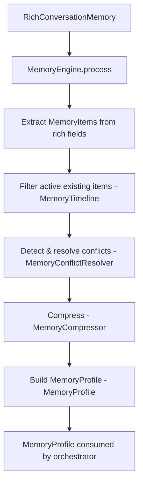

# Memory Intelligence Engine — Architecture (Layer 6)

## Overview

Layer 6 is the Memory Intelligence Engine. It answers:

- What information is worth remembering?
- How important is it?
- How long should it be retained?
- When do values conflict, and how are conflicts resolved?
- What memories are relevant for a given conversation context?

It operates exclusively on `RichConversationMemory` (from `ai/types.ts`) and produces
an immutable `MemoryProfile` — a structured aggregate that the orchestrator and
prompt assembler can consume instead of raw memory fields.

**Zero DB. Zero LLM. Zero side effects. Every function is pure and deterministic.**

---

## Memory Lifecycle



---

## Classification Model

Every memory field is classified into a domain:

| Domain | Fields |
|---|---|
| `identity` | name, phone, email |
| `property` | address, zip, location |
| `business` | company, industry, budget, timeline, decisionMaker, employeeCount |
| `preference` | service, preferredTime |
| `behavioral` | painPoints, goals, emergency, questionsAnswered, summary |
| `relationship` | objections, bookingStatus, servicesDiscussed |

---

## Importance Scoring

Each field has a base importance score (0–100). Low confidence reduces the score by up to 30%.

| Level | Score range | Examples |
|---|---|---|
| `critical` | 80–100 | phone, email, bookingStatus, emergency |
| `high` | 60–79 | name, service, company, budget |
| `medium` | 40–59 | timeline, goals, painPoints |
| `low` | 20–39 | questionsAnswered, summary |
| `negligible` | 0–19 | filtered on compression |

---

## Retention Policies

| Policy | Duration | Examples |
|---|---|---|
| `permanent` | Never expires | phone, email, name, bookingStatus |
| `1_year` | 365 days | address, company, industry, summary |
| `90_days` | 90 days | budget, timeline, objections, goals |
| `30_days` | 30 days | preferredTime |
| `session` | Current session | questionsAnswered |

---

## Conflict Resolution Strategies

| Strategy | Trigger | Outcome |
|---|---|---|
| `newest_wins` | bookingStatus, emergency, preferredTime | Incoming replaces existing |
| `highest_confidence_wins` | phone, email, name, budget | Higher confidence wins |
| `merge` | painPoints, goals, objections, servicesDiscussed | Arrays merged, deduplicated |
| `mark_uncertain` | Gap between confidence levels < 10 | Marked for revalidation |
| `require_revalidation` | Incoming confidence < 40 | Existing kept, flagged |

---

## Retrieval Strategy

`retrieveForContext(items, query)` returns relevant items for a given conversation context:

| Context | Key fields retrieved |
|---|---|
| `booking` | name, phone, email, address, service, preferredTime, emergency |
| `emergency` | name, phone, address, service, emergency |
| `sales` | company, budget, timeline, decisionMaker, painPoints, goals |
| `qualification` | company, industry, employeeCount, budget, timeline, decisionMaker |
| `returning_visitor` | name, phone, email, service, bookingStatus, servicesDiscussed |
| `support` | name, phone, email, service, objections |

---

## Compression Strategy

1. **Deduplication**: for the same key, keep the item with the highest confidence
2. **Negligible removal**: remove `negligible` items when the key has multiple entries
3. **removedCount** reported for observability

---

## Module Responsibilities

| Module | File | Responsibility |
|---|---|---|
| **MemoryEngine** | `MemoryEngine.ts` | Single entry point: `process()`, `retrieve()`, `getLowConfidence()` |
| **MemoryClassifier** | `MemoryClassifier.ts` | Field → domain classification |
| **MemoryImportance** | `MemoryImportance.ts` | Field + confidence → importance score + level |
| **MemoryRetention** | `MemoryRetention.ts` | Field + importance → retention policy |
| **MemoryScorer** | `MemoryScorer.ts` | Assembles a MemoryItem from raw field data |
| **MemoryConflictResolver** | `MemoryConflictResolver.ts` | Deterministic conflict resolution |
| **MemoryTimeline** | `MemoryTimeline.ts` | Expiry checking; `isExpired()`, `filterActive()` |
| **MemoryCompressor** | `MemoryCompressor.ts` | Deduplication + negligible removal |
| **MemorySummarizer** | `MemorySummarizer.ts` | Template-based human-readable summary |
| **MemoryRetriever** | `MemoryRetriever.ts` | Context-based retrieval |
| **MemoryProfile** | `MemoryProfile.ts` | Builds the frozen MemoryProfile aggregate |

---

## Integration with Layers 1–5

```
Layer 1 (BusinessIdentity)  → industry hint for classification context
Layer 2 (ResolvedIntent)    → retrieval context (booking/emergency/sales)
Layer 3 (ConversationPlan)  → objective → retrieval context mapping
Layer 4 (ResponseBlueprint) → no direct integration (downstream of L6)
Layer 5 (PromptAssembler)   → MemoryProfile.items → MemorySerializer
```

---

## Future Integration with Orchestrator

**Current path:**  
`runOrchestrator()` → `updateMemoryFromMessage()` → `RichConversationMemory`

**Layer 6 path (additive, no breaking changes):**
```typescript
// After step 3 in orchestrator
const profile = MemoryEngine.process({
  memory:         richMemory,
  conversationId: conversationId,
  organizationId: organizationId,
  existingItems:  session.memoryItems ?? [],   // from AIConversationSession
});

// Pass profile to prompt assembler instead of raw memory
PromptAssembler.build({ ..., memoryProfile: profile });
```

`RichConversationMemory` continues to exist unchanged.
`MemoryProfile` is an optional enhancement layer on top of it.

---

## File Structure

```
src/memory-engine/
├── ARCHITECTURE.md
├── index.ts
├── MemoryTypes.ts         ← all domain types
├── MemoryEngine.ts        ← single entry point
├── MemoryClassifier.ts    ← domain classification
├── MemoryImportance.ts    ← importance scoring
├── MemoryRetention.ts     ← retention policy
├── MemoryScorer.ts        ← MemoryItem builder
├── MemoryConflictResolver.ts ← conflict resolution
├── MemoryTimeline.ts      ← expiry logic
├── MemoryCompressor.ts    ← dedup + compression
├── MemorySummarizer.ts    ← template summary
├── MemoryRetriever.ts     ← context retrieval
├── MemoryProfile.ts       ← profile aggregate
└── __tests__/
    └── memory-engine.test.ts  ← 82 unit tests
```
