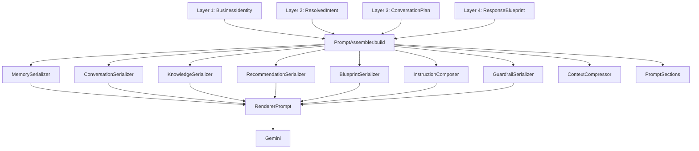

# Prompt Assembly Engine — Architecture (Layer 5)

## Overview

Layer 5 replaces the legacy `buildSystemPrompt()` pipeline with a structured
**Prompt Assembler** that consumes the outputs of Layers 1–4 and produces a
`RendererPrompt` — the only thing Gemini ever receives.

**Gemini is now a renderer, not a decision-maker.**
It receives structured instructions and produces one natural-language response.
Every business decision happened upstream in Layers 1–4.

---

## Why Gemini became a renderer

### Before Layer 5
```
Conversation State → buildSystemPrompt() → Gemini
```
Gemini received a mixed bag of memory, stage instructions, and freeform prompts.
It made implicit decisions about tone, what to ask next, and whether to escalate.
This was non-deterministic, hard to test, and impossible to audit.

### After Layer 5
```
Layer 1 (BusinessIdentity)   →
Layer 2 (ResolvedIntent)     →  PromptAssembler.build()  →  RendererPrompt  →  Gemini
Layer 3 (ConversationPlan)   →
Layer 4 (ResponseBlueprint)  →
```
Every decision is made by typed, testable, pure functions **before** Gemini is called.
Gemini's only job is to express the decision in natural language.

---

## Data Flow



---

## Section Order

Every prompt contains these sections in exactly this order:

```
1.  SYSTEM
2.  BUSINESS_IDENTITY
3.  CONVERSATION_MEMORY
4.  CURRENT_OBJECTIVE
5.  CONVERSATION_PLAN
6.  RESPONSE_BLUEPRINT
7.  KNOWLEDGE
8.  RECOMMENDATIONS
9.  CONVERSATION_HISTORY
10. GUARDRAILS
11. FINAL_INSTRUCTIONS
```

No section may appear twice. Empty sections are omitted.

---

## Module Responsibilities

| Module | File | Single Responsibility |
|---|---|---|
| **PromptAssembler** | `PromptAssembler.ts` | Orchestrates all serializers; produces RendererPrompt |
| **MemorySerializer** | `MemorySerializer.ts` | Memory → clean text (no confidence/source) |
| **ConversationSerializer** | `ConversationSerializer.ts` | History → trimmed window |
| **KnowledgeSerializer** | `KnowledgeSerializer.ts` | Knowledge hits → snippet block |
| **RecommendationSerializer** | `RecommendationSerializer.ts` | Recommendations → block or empty |
| **GuardrailSerializer** | `GuardrailSerializer.ts` | Universal + blueprint guardrails (deduplicated) |
| **RendererPrompt** | `RendererPrompt.ts` | ResponseBlueprint → structured instructions |
| **InstructionComposer** | `InstructionComposer.ts` | Identity + plan + blueprint → merged instruction block |
| **ContextCompressor** | `ContextCompressor.ts` | Dedup, window, trim, token estimate |
| **PromptSections** | `PromptSections.ts` | Section tagging and ordering |

---

## RendererPrompt interface

```typescript
interface RendererPrompt {
  systemPrompt:      string;   // full assembled system prompt
  knowledgeBlock:    string;   // knowledge snippets (separate for Gemini injection)
  memoryBlock:       string;
  conversationBlock: string;
  instructionBlock:  string;
  guardrailBlock:    string;
  responseBlueprint: string;
  metadata: {
    tokenEstimate:       number;
    compressionApplied:  boolean;
    sectionsIncluded:    PromptSection[];
  };
}
```

---

## Orchestrator Integration

The orchestrator wires Layers 1–5 in step 9:

```typescript
// Step 9b: Load Layer 1
const identity = await BusinessIdentityService.load(organizationId);

// Step 9b2: Adapt legacy plan to Layer 3 shape
const l3Plan = adaptToL3Plan(plan, nextStage);

// Step 9c: Layer 4 → ResponseBlueprint
const blueprint = ResponseEngine.buildBlueprint({ plan: l3Plan, identity, ... });

// Step 9d: Layer 5 → RendererPrompt
const rendererPrompt = PromptAssembler.build({ identity, plan: l3Plan, blueprint, ... });

// Step 10: Gemini receives structured instructions
const geminiResp = await sendToGemini({
  systemPrompt:   rendererPrompt.systemPrompt,
  knowledgeBlock: rendererPrompt.knowledgeBlock,
  history,
  userMessage,
});
```

Fallback: if `identity` is not available, the legacy `buildSystemPrompt()` is used.
`runOrchestrator()` public interface is **unchanged**.

---

## Extension Points

**Adding a new section:** Add to `PromptSection` union in `types.ts` and `SECTION_ORDER`. Add a serializer. Add it to `PromptAssembler.sectionMap`.

**Changing guardrail rules:** Edit `UNIVERSAL_GUARDRAILS` in `GuardrailSerializer.ts`.

**Changing token budget:** Adjust `COMPRESSION_THRESHOLD` in `ContextCompressor.ts`.

**Different history window:** Pass `maxHistory` to `PromptAssembler.build()`.

**Different knowledge limit:** Pass `maxKnowledge` to `PromptAssembler.build()`.

---

## File Structure

```
src/prompt-assembly/
├── ARCHITECTURE.md
├── index.ts
├── types.ts
├── PromptAssembler.ts        ← single entry point
├── MemorySerializer.ts
├── ConversationSerializer.ts
├── KnowledgeSerializer.ts
├── RecommendationSerializer.ts
├── GuardrailSerializer.ts
├── RendererPrompt.ts
├── InstructionComposer.ts
├── ContextCompressor.ts
├── PromptSections.ts
└── __tests__/
    └── prompt-assembly.test.ts  ← 67 unit tests
```
